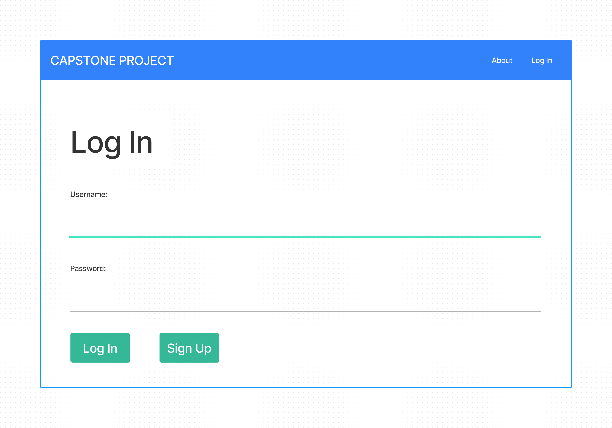
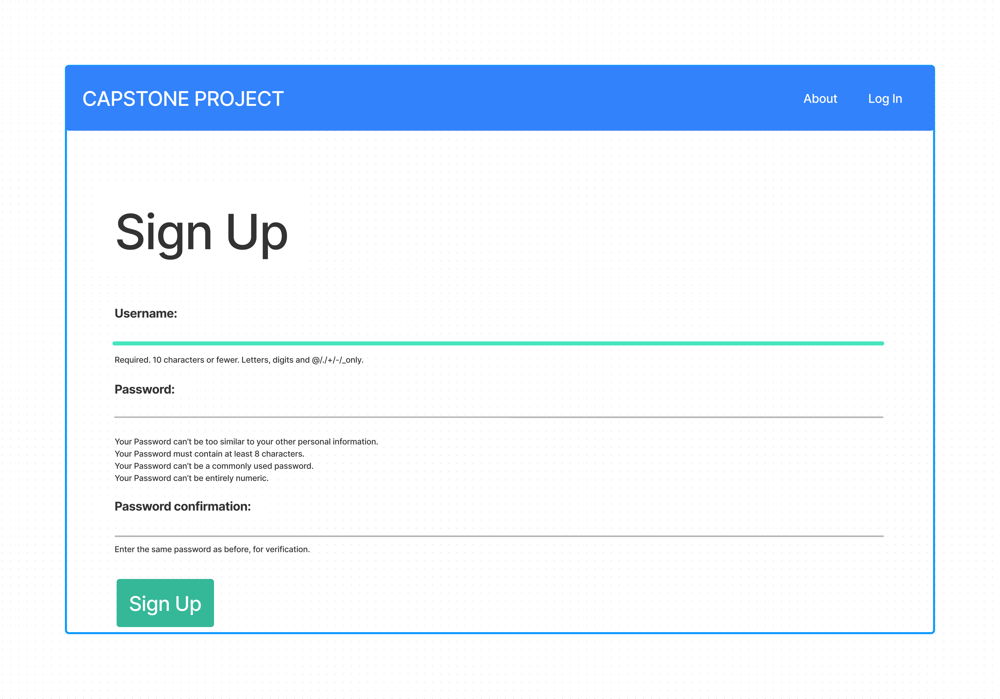
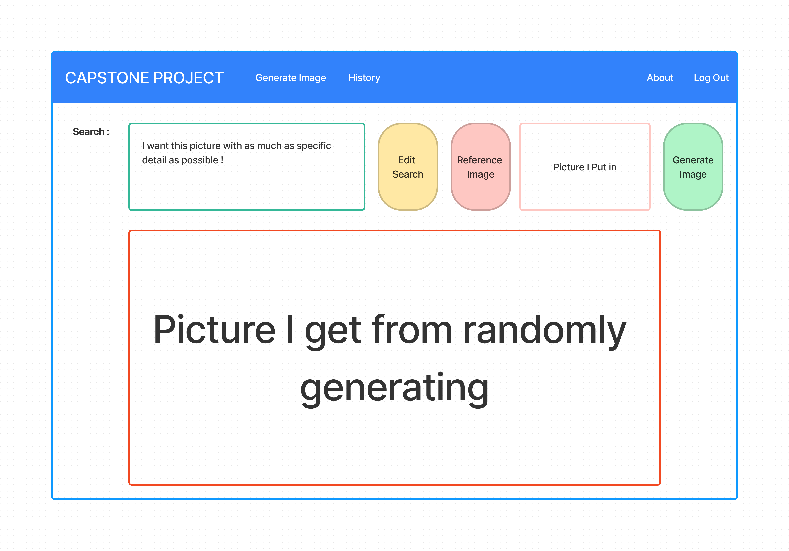
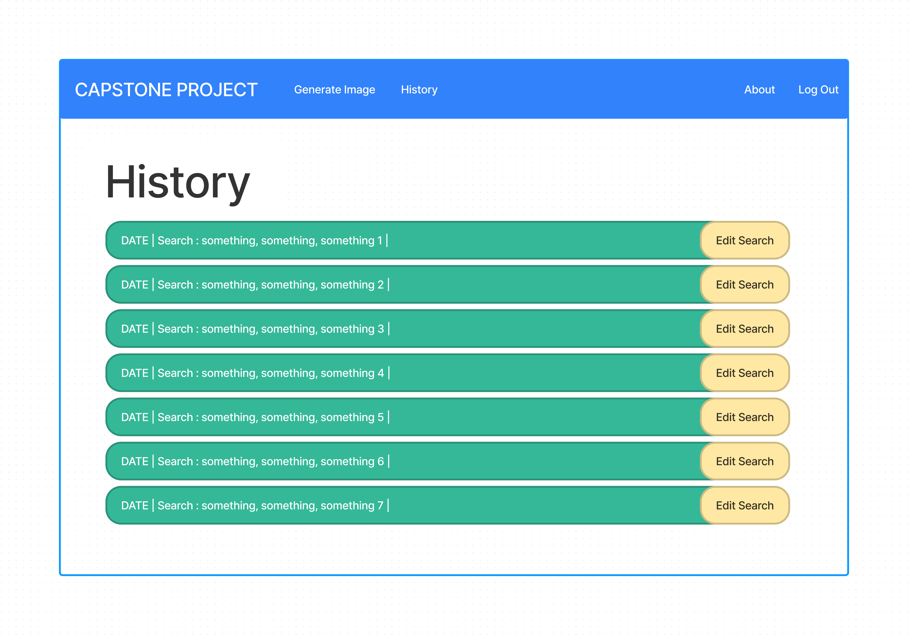
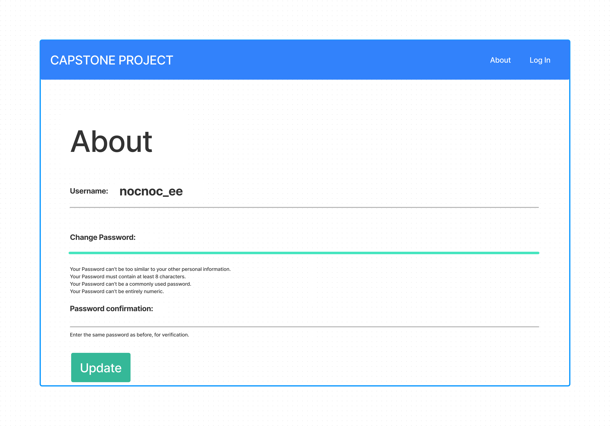
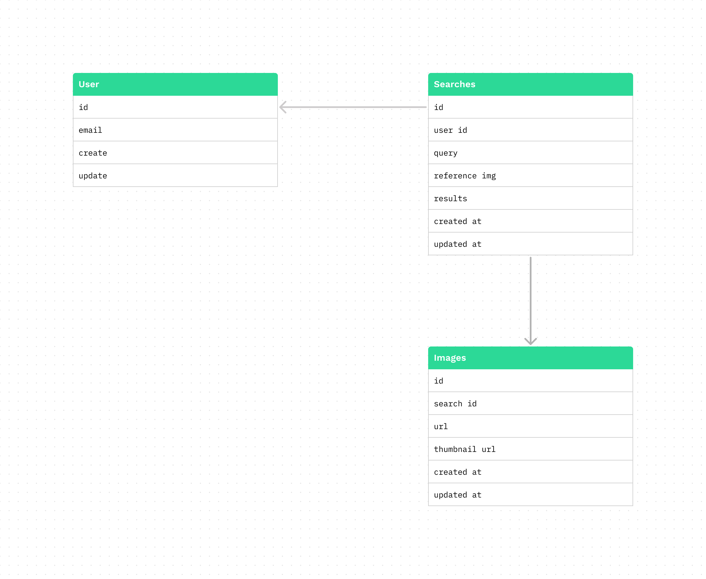

### capstone-project

### User Stopries

* As a user, I would like to sign up with username and password.
* As a user, I would like to sin in with my username and password.
* As a user, I would like to change password.
* As a user, I would like to sign out.
* As a user, I would like to search for the picture I want through the AI.
* As a user, I would like to put my own reference picture.
* As a user, I would like to see the pictures I searched.
* As a user, I would like to edit my search.
* As a user, I would like to delete my search.

### Wireframe

### ERD

### Technologies Used
* HTML
* CSS
* Python
* Django
* 

### User

## Authentication
| URL                 | HTTP Verb | Action              |
|---------------------|-----------|---------------------|
| `/auth/sign-up`     | `POST`    | Create a new user    |
| `/auth/login`       | `POST`    | Authenticate a user  |
| `/auth/logout`      | `DELETE`  | Log out a user       |
| `/auth/change-pwd`  | `PUT`     | Change user password |

## Searches
| URL                        | HTTP Verb | Action                 |
|----------------------------|-----------|------------------------|
| `/searches`                | `GET`     | List all user searches |
| `/searches`                | `POST`    | Create a new search     |
| `/searches/:id`            | `GET`     | Show a specific search  |
| `/searches/:id`            | `PUT`     | Update a specific search|
| `/searches/:id`            | `DELETE`  | Delete a specific search|

## Images
| URL                                  | HTTP Verb | Action                     |
|--------------------------------------|-----------|----------------------------|
| `/searches/:search_id/images`        | `GET`     | List all images for a search|
| `/searches/:search_id/images`        | `POST`    | Add a new image to a search |
| `/searches/:search_id/images/:id`    | `GET`     | Show a specific image      |
| `/searches/:search_id/images/:id`    | `PUT`     | Update a specific image    |
| `/searches/:search_id/images/:id`    | `DELETE`  | Delete a specific image    |

